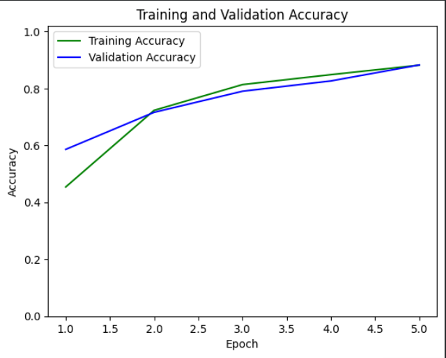
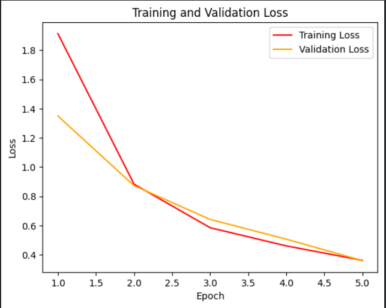
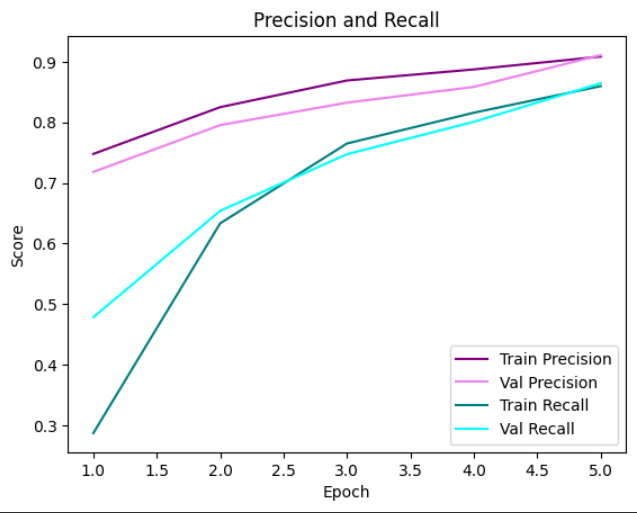

# 🌿 Plant Disease Detection System for Sustainable Agriculture


A deep learning system that classifies plant leaf diseases across 14 crop species into 38 categories. Built to support early disease detection in agriculture, reducing crop loss and minimizing unnecessary pesticide use.

---

## 📋 Table of Contents
- [Overview](#overview)
- [Dataset](#dataset)
- [Model Architecture](#model-architecture)
- [Results](#results)
- [Supported Classes](#supported-classes)
- [Getting Started](#getting-started)
- [Project Structure](#project-structure)
- [Future Work](#future-work)

---

## Overview

This project uses a custom CNN trained on the [New Plant Diseases Dataset (Augmented)](https://www.kaggle.com/datasets/vipoooool/new-plant-diseases-dataset) from Kaggle. The model takes a 224×224 RGB leaf image as input and outputs one of 38 disease or healthy-plant labels.

The goal is to assist farmers and agronomists in identifying diseases early, enabling timely intervention and contributing to more sustainable crop management.

---

## Dataset

| Split      | Images  | Notes                          |
|------------|---------|--------------------------------|
| Training   | 63,282  | 90° rotation augmentation      |
| Validation | 1,742   | Rescale only                   |
| Test       | 17,572  | Rescale only, no shuffle       |

- **Input size:** 224 × 224 × 3 (RGB)
- **Classes:** 38 (disease + healthy labels across 14 crop types)
- **Source:** New Plant Diseases Dataset (Augmented) on Kaggle

---

## Model Architecture

A custom sequential CNN with ~26.1M trainable parameters.

| Layer   | Type          | Output Shape           | Params     |
|---------|---------------|------------------------|------------|
| Conv1   | Conv2D        | (None, 224, 224, 32)   | 4,736      |
| Pool1   | MaxPool2D     | (None, 112, 112, 32)   | 0          |
| Conv2   | Conv2D        | (None, 112, 112, 64)   | 51,264     |
| Pool2   | MaxPool2D     | (None, 56, 56, 64)     | 0          |
| Conv3   | Conv2D        | (None, 56, 56, 128)    | 73,856     |
| Conv4   | Conv2D        | (None, 56, 56, 256)    | 295,168    |
| Pool3   | MaxPool2D     | (None, 28, 28, 256)    | 0          |
| Flatten | Flatten       | (None, 200704)         | 0          |
| Dense1  | Dense (ReLU)  | (None, 128)            | 25,690,240 |
| Dense2  | Dense (ReLU)  | (None, 64)             | 8,256      |
| Output  | Dense(Softmax)| (None, 38)             | 2,470      |

**Total parameters:** 26,125,990 (~99.7 MB)

**Training config:**
- Optimizer: Adam
- Loss: Categorical Crossentropy
- Callbacks: EarlyStopping, ModelCheckpoint, ReduceLROnPlateau

---

## Results

### Training history (5 epochs)       

| Epoch | Train Loss | Train Acc  | Val Loss | Val Acc | Val Precision | Val Recall |
|-------|------------|------------|----------|---------|---------------|------------|
| 1     | 1.9135     | 45.40%     | 1.3499   | 58.61%  | 71.81%        | 47.82%     |
| 2     | 0.8831     | 72.34%     | 0.8731   | 71.64%  | 79.54%        | 65.38%     |
| 3     | 0.5850     | 81.38%     | 0.6419   | 79.05%  | 83.25%        | 74.74%     |
| 4     | 0.4607     | 84.88%     | 0.5065   | 82.66%  | 85.85%        | 80.08%     |
| **5** | **0.3747** | **87.69%** | **—**    | **—**   | **—**         | **—**      |

### Test set evaluation (17,572 images)        

| Metric    | Score      |
|-----------|------------|
| Loss      | 0.3464     |
| Accuracy  | **88.74%** |
| Precision | **91.19%** |
| Recall    | **86.75%** |

### 📊 Training Curves

> Generated using `matplotlib` after model training.

**Accuracy over epochs**
```python
plt.plot(epochs, acc,     color='green', label='Training Accuracy')
plt.plot(epochs, val_acc, color='blue',  label='Validation Accuracy')
plt.title('Training and Validation Accuracy')
plt.ylabel('Accuracy')
plt.xlabel('Epoch')
plt.legend()
plt.ylim(0, 1.02)
plt.show()
```


---

**Loss over epochs**
```python
plt.plot(epochs, loss,     color='red',    label='Training Loss')
plt.plot(epochs, val_loss, color='orange', label='Validation Loss')
plt.title('Training and Validation Loss')
plt.ylabel('Loss')
plt.xlabel('Epoch')
plt.legend()
plt.show()
```


---

**Precision & Recall over epochs**
```python
plt.plot(epochs, precision,     color='purple', label='Training Precision')
plt.plot(epochs, val_precision, color='violet', label='Validation Precision')
plt.plot(epochs, recall,        color='teal',   label='Training Recall')
plt.plot(epochs, val_recall,    color='cyan',   label='Validation Recall')
plt.title('Precision and Recall')
plt.ylabel('Score')
plt.xlabel('Epoch')
plt.legend()
plt.show()
```


---

## Supported Classes

38 classes across 14 plant species. Healthy classes are marked ✅.

<details>
<summary>Click to expand all 38 classes</summary>

- Apple — Apple Scab
- Apple — Black Rot
- Apple — Cedar Apple Rust
- Apple — Healthy ✅
- Blueberry — Healthy ✅
- Cherry — Powdery Mildew
- Cherry — Healthy ✅
- Corn — Cercospora / Gray Leaf Spot
- Corn — Common Rust
- Corn — Northern Leaf Blight
- Corn — Healthy ✅
- Grape — Black Rot
- Grape — Esca (Black Measles)
- Grape — Leaf Blight (Isariopsis Leaf Spot)
- Grape — Healthy ✅
- Orange — Haunglongbing (Citrus Greening)
- Peach — Bacterial Spot
- Peach — Healthy ✅
- Pepper (Bell) — Bacterial Spot
- Pepper (Bell) — Healthy ✅
- Potato — Early Blight
- Potato — Late Blight
- Potato — Healthy ✅
- Raspberry — Healthy ✅
- Soybean — Healthy ✅
- Squash — Powdery Mildew
- Strawberry — Leaf Scorch
- Strawberry — Healthy ✅
- Tomato — Bacterial Spot
- Tomato — Early Blight
- Tomato — Late Blight
- Tomato — Leaf Mold
- Tomato — Septoria Leaf Spot
- Tomato — Spider Mites / Two-Spotted Spider Mite
- Tomato — Target Spot
- Tomato — Yellow Leaf Curl Virus
- Tomato — Mosaic Virus
- Tomato — Healthy ✅

</details>

---

## Getting Started

### Prerequisites
```bash
pip install tensorflow numpy pandas matplotlib opencv-python seaborn
```

### Load the saved model
```python
from tensorflow import keras
import numpy as np

model = keras.models.load_model('PDDS.keras')

# Preprocess and predict
img = keras.preprocessing.image.load_img('leaf.jpg', target_size=(224, 224))
img_array = keras.preprocessing.image.img_to_array(img) / 255.0
img_array = np.expand_dims(img_array, axis=0)

predictions = model.predict(img_array)
predicted_class = np.argmax(predictions[0])
```

### Train from scratch
Run the notebook in Google Colab. Mount your Drive, extract the dataset zip, and execute all cells in order.

---

## Project Structure

```
plant-disease-detection/
├── PDDS.keras                        # Final saved model (all epochs)
├── best_model.keras                  # Best checkpoint (lowest val_loss)
├── plant_disease_CNN.ipynb           # Training notebook (Google Colab)
├── assets/
│   ├── accuracy_plot.png             # Training vs validation accuracy graph
│   ├── loss_plot.png                 # Training vs validation loss graph
│   └── precision_recall_plot.png     # Precision & recall over epochs
└── README.md                         # Project documentation
```

---

## Future Work

- [ ] Apply transfer learning (EfficientNetB3 / ResNet50) for higher accuracy
- [ ] Fix Dropout layers — currently instantiated but not added to the model
- [ ] Deploy with TensorFlow Lite for on-device mobile inference
- [ ] Add Grad-CAM visualisation to highlight diseased regions in leaves
- [ ] Build a simple web/mobile interface for farmers
- [ ] Expand to more regional crop varieties and disease types

---

## Acknowledgements

- Dataset: [vipoooool — New Plant Diseases Dataset on Kaggle](https://www.kaggle.com/datasets/vipoooool/new-plant-diseases-dataset)
- Training environment: Google Colab (GPU)
